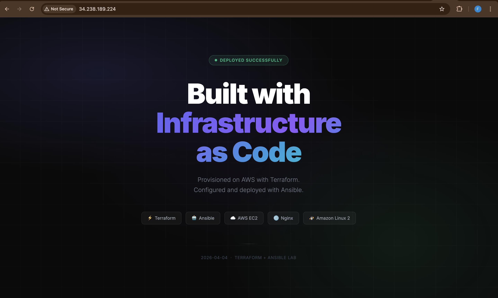

# Terraform + Ansible — EC2 Web App Lab

> Provision an EC2 instance with Terraform and configure an Nginx web server with Ansible using SSH key-based authentication.

---

## Repository Structure

```
terraform-ansible/
├── terraform/
│   ├── main.tf                  # Provider, SG, Key Pair, EC2, inventory generation
│   ├── variables.tf             # Input variables with defaults
│   ├── outputs.tf               # Public IP, DNS, SSH command, key path
│   └── inventory.tftpl          # Template rendered into ansible/inventory.ini
├── ansible/
│   ├── ansible.cfg              # Ansible defaults
│   ├── inventory.ini            # Auto-generated by Terraform
│   ├── site.yml                 # Main playbook
│   └── templates/
│       └── index.html.j2        # Jinja2 HTML page served by Nginx
├── APPLY.txt                    # terraform apply output
├── DESTROY.txt                  # terraform destroy output
└── README.md
```

---

## Prerequisites

| Tool      | Version   | Check                  |
|-----------|-----------|------------------------|
| Terraform | >= 1.5.0  | `terraform -v`         |
| Ansible   | >= 2.14   | `ansible --version`    |
| AWS CLI   | any       | `aws --version`        |
| Python    | >= 3.9    | `python3 --version`    |

Configure AWS credentials before running:

```bash
aws configure
# AWS Access Key ID:     <your-key-id>
# AWS Secret Access Key: <your-secret-key>
# Default region:        us-east-1
```

---

## How It Works

```
┌─────────────────────────────────────────────────────────┐
│  LOCAL MACHINE                                          │
│                                                         │
│  terraform apply                                        │
│    ├── generates RSA key pair (webapp-lab-key.pem)      │
│    ├── registers public key as AWS Key Pair             │
│    ├── creates Security Group (port 22 + 80)            │
│    ├── launches EC2 t2.micro (Amazon Linux 2)           │
│    └── writes ansible/inventory.ini automatically       │
│                                                         │
│  ansible-playbook site.yml                              │
│    ├── bootstraps Python 3.9 on EC2 (raw SSH)           │
│    ├── installs Nginx via amazon-linux-extras           │
│    ├── enables + starts Nginx service                   │
│    ├── deploys index.html.j2 template                   │
│    └── smoke-tests HTTP 200 from localhost              │
└─────────────────────────────────────────────────────────┘
                          │
                          ▼
              ┌───────────────────────┐
              │  AWS EC2 (us-east-1)  │
              │  Amazon Linux 2       │
              │  t2.micro / t3.micro  │
              │  Nginx :80            │
              └───────────────────────┘
```

---

## Step-by-Step Execution

### 1 — Initialize and apply Terraform

```bash
cd terraform/
terraform init
terraform apply -auto-approve 2>&1 | tee ../APPLY.txt
```

Terraform will output the public IP and generate `ansible/inventory.ini` automatically.

### 2 — Wait for SSH to be ready

```bash
IP=$(terraform output -raw instance_public_ip)
until nc -zw3 "$IP" 22; do echo "waiting..."; sleep 5; done
echo "SSH ready"
```

### 3 — Run the Ansible playbook

```bash
cd ../ansible/
ansible-playbook -i inventory.ini site.yml
```

### 4 — Verify

```bash
curl -I http://$IP        # expect: HTTP/1.1 200 OK
```

Open `http://<public-ip>` in a browser and take a screenshot.

### 5 — Destroy all resources

```bash
cd ../terraform/
terraform destroy -auto-approve 2>&1 | tee ../DESTROY.txt
```

---

## Terraform Resources

| Resource | Description | Registry Docs |
|---|---|---|
| `tls_private_key` | Generates 4096-bit RSA key pair | [docs](https://registry.terraform.io/providers/hashicorp/tls/latest/docs/resources/private_key) |
| `local_sensitive_file` | Writes private key with `0400` permissions | [docs](https://registry.terraform.io/providers/hashicorp/local/latest/docs/resources/sensitive_file) |
| `aws_key_pair` | Registers public key in AWS | [docs](https://registry.terraform.io/providers/hashicorp/aws/latest/docs/resources/key_pair) |
| `aws_security_group` | Security group (no inline rules) | [docs](https://registry.terraform.io/providers/hashicorp/aws/latest/docs/resources/security_group) |
| `aws_vpc_security_group_ingress_rule` | Inbound rules — SSH (22), HTTP (80) | [docs](https://registry.terraform.io/providers/hashicorp/aws/latest/docs/resources/vpc_security_group_ingress_rule) |
| `aws_vpc_security_group_egress_rule` | Outbound rule — all traffic | [docs](https://registry.terraform.io/providers/hashicorp/aws/latest/docs/resources/vpc_security_group_egress_rule) |
| `data.aws_ami` | Latest Amazon Linux 2 AMI | [docs](https://registry.terraform.io/providers/hashicorp/aws/latest/docs/data-sources/ami) |
| `aws_instance` | EC2 t2.micro / t3.micro | [docs](https://registry.terraform.io/providers/hashicorp/aws/latest/docs/resources/instance) |
| `local_file` | Auto-generates `inventory.ini` | [docs](https://registry.terraform.io/providers/hashicorp/local/latest/docs/resources/file) |

---

## Ansible Playbook Structure

### Play 1 — Bootstrap Python 3.9
Uses `raw` module (pure SSH, no Python required) to install Python 3.9 from source on the EC2 instance. Required because Amazon Linux 2 ships with Python < 3.9 and modern Ansible requires 3.9+.

### Play 2 — Deploy Nginx
| Task | Module | Purpose |
|---|---|---|
| Install Nginx | `ansible.builtin.command` | `amazon-linux-extras install nginx1` |
| Enable + start service | `ansible.builtin.service` | Ensures Nginx runs on boot |
| Deploy index page | `ansible.builtin.template` | Renders `index.html.j2` → `/usr/share/nginx/html/index.html` |
| Smoke test | `ansible.builtin.uri` | Verifies HTTP 200 from localhost |

Handler `reload nginx` fires only when the template changes — ensures idempotent runs.

---

## Key Design Decisions

| Decision | Reason |
|---|---|
| `tls_private_key` resource | Key generated inside Terraform — no manual `ssh-keygen` step |
| `aws_vpc_security_group_ingress_rule` | Current AWS provider standard — replaces deprecated inline `ingress` blocks |
| `inventory.tftpl` templatefile | Inventory auto-generated after apply with correct IP and key path |
| `amazon-linux-extras install nginx1` | Correct method for Nginx on Amazon Linux 2 — `yum install nginx` does not work |
| Python 3.9 compiled from source | `amazon-linux-extras` does not provide Python 3.9; modern Ansible requires it |
| Handler `reload nginx` | Graceful reload only on config change — not on every playbook run |
| Local backend (no S3) | Single-user, short-lived lab — remote backend would add unnecessary complexity |

---

## Outputs

After `terraform apply`:

```
instance_public_ip    = "x.x.x.x"
instance_public_dns   = "ec2-x-x-x-x.compute-1.amazonaws.com"
ssh_user              = "ec2-user"
key_name              = "webapp-lab-key"
private_key_path      = "/path/to/webapp-lab-key.pem"
ssh_connect_command   = "ssh -i /path/to/webapp-lab-key.pem ec2-user@x.x.x.x"
```

---
## 📸 Screenshots

The `screenshots/` folder contains evidence of:

* Web Page
   
## Troubleshooting

| Error | Cause | Fix |
|---|---|---|
| `UnauthorizedOperation: ec2:RunInstances` | SCP blocking EC2 at org level | Ask admin to grant EC2 permissions |
| `not eligible for Free Tier` | `t2.micro` not free in your region | Change to `t3.micro` in `variables.tf` |
| `No package python38 available` | Amazon Linux 2 needs `amazon-linux-extras` | Use `amazon-linux-extras enable python3.8` first |
| `Ansible requires Python 3.9+` | EC2 Python too old | Bootstrap Python 3.9 from source (Play 1) |
| `No changes` on destroy | Wrong directory — state file not found | Always run `terraform destroy` from `terraform/` folder |
| SG description error | Non-ASCII character in description | Use plain ASCII dash `-` not `—` |

---

## Tools & Versions

- Terraform `>= 1.5.0` — [terraform.io](https://www.terraform.io)
- Ansible `>= 2.14` — [ansible.com](https://www.ansible.com)
- AWS Provider `~> 5.0` — [registry.terraform.io](https://registry.terraform.io/providers/hashicorp/aws/latest)
- TLS Provider `~> 4.0` — [registry.terraform.io](https://registry.terraform.io/providers/hashicorp/tls/latest)

## 👨‍💻 Author

Furaha Justine